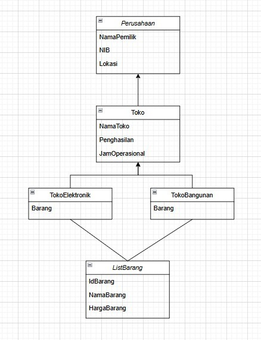

# TP3DPBO2425C2

/*saya Ajipati Alaga Putra dengan NIM 2409682
mengerjakan TP3 dalam mata kuliah DPBO
untuk keberkahannya maka saya tidak akan melakukan kecurangan
sepertu yang telah di spesifikasikan Aamiin.*/

Design

1. Penjelasan Atribut dan Method per Kelas

🔹 Perusahaan

Atribut:
nib → Nomor Induk Berusaha (identitas legal perusahaan).
pemilik → Nama pemilik perusahaan.
lokasi → Lokasi berdirinya perusahaan.
Method:
Getter & Setter untuk semua atribut (getNIB(), setNIB(), dll).
tampilkanInfo() → Menampilkan informasi umum perusahaan.

🔹 ListBarang

Atribut:

id → Nomor unik barang.
namaBarang → Nama barang.
harga → Harga barang.

Method:

Getter & Setter untuk setiap atribut.
tampilkanBarang() → Menampilkan informasi barang per baris tabel.

🔹 Toko (turunan dari Perusahaan)

Atribut:

namaToko → Nama toko.
penghasilan → Jumlah pendapatan toko.
jamOperasional → Jam buka dan tutup toko.
listBarang → List/array of ListBarang → di sini terjadi composition (has-a).

Method:

Getter & Setter untuk semua atribut.
tambahBarang() → Menambahkan barang ke daftar barang.
tampilkanTabelBarang() → Menampilkan tabel barang (jika kosong, tampil tabel header kosong).
tampilkanInfo() → Menampilkan data toko + data perusahaan.

🔹 TokoElektronik (turunan dari Toko)

Atribut:

Tidak menambah atribut baru (hanya kategori khusus).

Method:

Override tampilkanInfo() → Menambahkan label Toko Elektronik.

🔹 TokoBangunan (turunan dari Toko)

Atribut:

Sama seperti Toko.

Method:

Override tampilkanInfo() → Menambahkan label Toko Bangunan.

2. Penjelasan Desain Program

Inheritance (Is-a relationship)
TokoElektronik is a Toko.
TokoBangunan is a Toko.
Toko is a Perusahaan.

Artinya:

Setiap toko adalah bagian dari perusahaan.
Setiap toko bisa berupa toko khusus: Elektronik atau Bangunan.
Composition (Has-a relationship)
Toko has a ListBarang.
Barang tidak bisa ada tanpa toko → jika toko dihapus, maka daftar barangnya ikut hilang.

3. Penjelasan Alur Program

Membuat objek toko
Buat instance TokoElektronik dan TokoBangunan dengan data dummy.
Menambahkan barang
Memanggil method tambahBarang() untuk memasukkan barang ke dalam toko masing-masing.
Menampilkan tabel kosong (opsional)
Jika barang belum ada, program tetap menampilkan tabel header tetapi tanpa isi (kosong).
Menampilkan tabel berisi barang
Setelah barang ditambahkan, panggil tampilkanTabelBarang() untuk menampilkan tabel dengan data barang.

Output

Data perusahaan, toko, dan daftar barang ditampilkan rapi dalam format tabel.

DOKUMENTASI :

CPP

Java

Python

